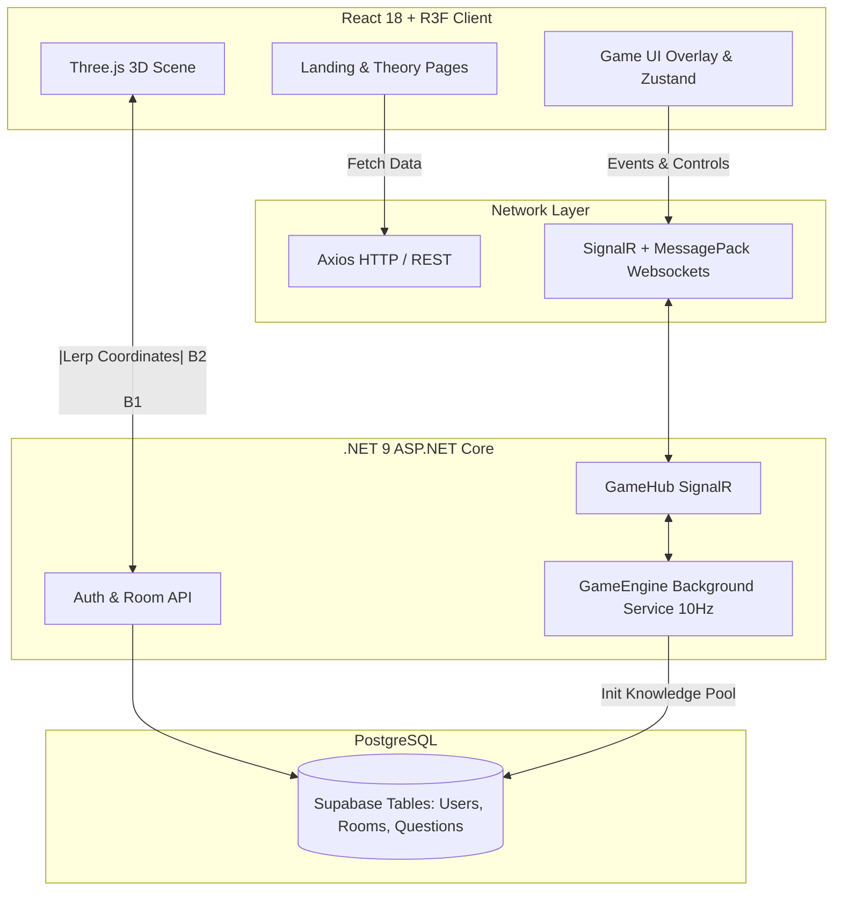

# BÁO CÁO DỰ ÁN SẢN PHẨM SÁNG TẠO

**Tên trường:** Đại học FPT  
**Tên môn học:** HCM202 – Tư tưởng Hồ Chí Minh  
**Tên dự án:** Website học tập và trò chơi tương tác môn Tư tưởng Hồ Chí Minh (Muông Thú Thông Thái - Animal Theory Royale)  
**Tên nhóm:** HCM202 - Group 3
**Lớp:** SU 26_HCM202_MKT1833-DIG 
**Giảng viên:** Kiều Văn Nam
**Ngày thực hiện:** May 29, 2026

---

## MỤC LỤC
1. [Giới thiệu dự án](#1-giới-thiệu-dự-án)
2. [Mục tiêu dự án](#2-mục-tiêu-dự-án)
3. [Đối tượng sử dụng](#3-đối-tượng-sử-dụng)
4. [Tổng quan hệ thống](#4-tổng-quan-hệ-thống)
5. [Công nghệ sử dụng](#5-công-nghệ-sử-dụng)
6. [Phân tích chức năng chi tiết](#6-phân-tích-chức-năng-chi-tiết)
7. [Thiết kế giao diện và trải nghiệm người dùng](#7-thiết-kế-giao-diện-và-trải-nghiệm-người-dùng)
8. [Giá trị giáo dục của sản phẩm](#8-giá-trị-giáo-dục-của-sản-phẩm)
9. [Kiến trúc hệ thống](#9-kiến-trúc-hệ-thống)
10. [Luồng hoạt động chính của hệ thống](#10-luồng-hoạt-động-chính-của-hệ-thống)
11. [Kiểm thử và kết quả đạt được](#11-kiểm-thử-và-kết-quả-đạt-được)
12. [Hạn chế hiện tại](#12-hạn-chế-hiện-tại)
13. [Định hướng phát triển](#13-định-hướng-phát-triển)
14. [Kết luận](#14-kết-luận)
15. [Phụ lục](#15-phụ-lục)

---

## 1. Giới thiệu dự án

**Lý do thực hiện dự án**  
Các môn học lý luận chính trị, đặc biệt là Tư tưởng Hồ Chí Minh (HCM202), thường mang khối lượng kiến thức lớn, yêu cầu mức độ ghi nhớ và thấu hiểu cao. Tuy nhiên, phương pháp tiếp cận truyền thống qua tài liệu văn bản đôi khi chưa tạo được sự hứng thú và tương tác tối đa cho sinh viên. 

**Ý tưởng kết hợp lý thuyết với trò chơi học tập**  
Dự án "Muông Thú Thông Thái" (Animal Theory Royale) ra đời với mong muốn tạo ra một nền tảng học tập kết hợp EdTech (Giáo dục qua công nghệ) và Gamification (Game hóa). Hệ thống không chỉ cung cấp nền tảng học tập lý thuyết trực quan (Concept Explorer) mà còn tích hợp một trò chơi đấu trường 3D (Theory Royale) để sinh viên có thể ôn tập, thi đấu và kiểm tra kiến thức của mình một cách chủ động, sinh động.

## 2. Mục tiêu dự án

- **Số hóa nội dung học tập môn HCM202:** Trình bày lý thuyết theo cấu trúc rõ ràng, có phân chia chương mục.
- **Tạo môi trường học tập trực quan:** Sử dụng Sơ đồ tư duy (Bản đồ tri thức) và trục thời gian (Timeline) để liên kết các luồng tư tưởng lịch sử.
- **Kết hợp kiến thức lý thuyết với hình thức game hóa:** Biến bài kiểm tra trắc nghiệm khô khan thành trải nghiệm sinh tồn kịch tính, thu thập điểm kiến thức.
- **Tăng khả năng tương tác và ghi nhớ:** Sinh viên phải áp dụng trực tiếp kiến thức đã học để chiến thắng trò chơi, từ đó ghi nhớ sâu hơn.
- **Công cụ hỗ trợ giảng viên:** Cung cấp hệ thống tạo phòng chơi, theo dõi tiến độ sinh viên theo thời gian thực để tạo các hoạt động ôn tập sôi nổi trên lớp.

## 3. Đối tượng sử dụng

- **Sinh viên (Player):** Những người đang học môn HCM202, sử dụng hệ thống để học lý thuyết từ xa và tham gia thi đấu ôn tập kiến thức.
- **Giảng viên (Host):** Quản lý quá trình học và ôn tập trên lớp thông qua việc khởi tạo phòng game, tùy chỉnh thời gian/số lượng câu hỏi và theo dõi bảng xếp hạng sinh viên.

## 4. Tổng quan hệ thống

Hệ thống được chia thành các module chính nhằm tách biệt rõ ràng luồng học tập và luồng tương tác thực tế:

- **Trang chủ (Landing Page):** Cổng điều hướng cho phép sinh viên chọn vào khu vực học lý thuyết (Concept Explorer) hoặc vào thẳng Đấu trường thi đấu (Game Mode).
- **Phần lý thuyết (Concept Explorer):** Cung cấp các trang chi tiết bài học/chương học, tích hợp Sơ đồ tư duy (Bản đồ tri thức), Timeline lịch sử, Case Files và khu vực Ôn tập.
- **Phòng chờ (Lobby):** Chức năng tạo phòng (dành cho Host) và tham gia phòng bằng mã 5 ký tự (dành cho Sinh viên). Người chơi được chọn 1 trong 4 nhân vật đại diện (Voi, Thỏ, Cáo, Rùa).
- **Phần trò chơi (Game Engine 3D):** Môi trường thi đấu Battle Royale, kết hợp hệ thống "Cột sáng kiến thức", vòng bo an toàn và bảng xếp hạng trực tiếp.
- **Bảng điều khiển Giảng viên (Host Dashboard):** Màn hình hiển thị radar 2D theo dõi người chơi, bảng xếp hạng (Leaderboard) thời gian thực và quản lý bắt đầu/kết thúc trận đấu.
- **Hệ thống kết quả (Result):** Vinh danh Top 3 và hiển thị điểm tổng kết cuối trận.

## 5. Công nghệ sử dụng

Dự án áp dụng các công nghệ hiện đại, đáp ứng tốt yêu cầu xử lý đồ họa trên trình duyệt và đồng bộ hóa dữ liệu thời gian thực:

| Hạng mục | Công nghệ sử dụng | Ý nghĩa trong dự án |
| :--- | :--- | :--- |
| **Frontend** | React 18, Vite, TypeScript, TailwindCSS | Xây dựng giao diện UI/UX tốc độ cao, responsive. |
| **Đồ họa 3D** | React Three Fiber (R3F), Three.js | Dựng môi trường game 3D trực tiếp trên web. |
| **State Management** | Zustand | Quản lý trạng thái ứng dụng nhẹ nhàng, linh hoạt. |
| **Backend** | C# ASP.NET Core 9 Web API | Xử lý logic máy chủ, xác thực và quản trị phòng chơi. |
| **Realtime** | SignalR, MessagePack protocol | Đồng bộ hóa tọa độ 3D và trạng thái game với tần số quét 10Hz, độ trễ cực thấp. |
| **Database** | PostgreSQL, Entity Framework Core | Lưu trữ ngân hàng câu hỏi HCM202 và dữ liệu cấu hình trận đấu. |
| **Deployment** | Vercel (Frontend), Render (Backend) & Supabase (Database) | Đưa hệ thống lên môi trường Internet thực tế. |

## 6. Phân tích chức năng chi tiết

### 6.1. Chức năng học lý thuyết (Concept Explorer)
Hệ thống học tập phi tuyến tính, cho phép sinh viên tiếp cận bài giảng bằng nhiều hình thức trực quan thông qua các thanh điều hướng:
- **Nội dung giáo trình:** Cung cấp kiến thức môn học được cấu trúc bài bản theo chuẩn giáo trình. Sinh viên tự do điều hướng và hệ thống sẽ lưu lại tiến độ học tập.
- **Bản đồ tri thức:** Biểu diễn các khái niệm của Tư tưởng Hồ Chí Minh dưới dạng đồ thị nối kết (Node graph). Các node chứa thông tin sâu như ý nghĩa, liên hệ thực tiễn và trích dẫn nguồn giáo trình.
- **Timeline:** Trục thời gian trải dài các mốc sự kiện quan trọng trong quá trình hình thành tư tưởng của Người.
- **Case Files:** Cung cấp tài liệu tham khảo, các hồ sơ thực tiễn và phân tích chuyên sâu.
- **Ôn tập:** Khu vực tổng hợp, kiểm tra nhanh kiến thức trước khi bước vào Game Mode.

`[Ảnh 1: Giao diện Concept Explorer / Bản đồ tri thức]`

### 6.2. Chức năng trò chơi học tập (Theory Royale)
Đấu trường sinh tồn 3D nơi sinh viên nhập vai vào 4 nhân vật (Voi: Phòng thủ cao, Thỏ: Tốc độ cao, Cáo: Chiến thuật, Rùa: Ổn định) để thi đấu:
- **Hệ thống "Cột sáng kiến thức":** Chứa các câu hỏi trắc nghiệm môn HCM202 (Normal, Boss, LootBox, Trap). Sinh viên cần tương tác, trả lời đúng trong thời gian quy định để nhận điểm sinh tồn và buff chỉ số.
- **Cơ chế tính điểm & Combo:** Trả lời đúng liên tiếp tạo multiplier (x2, x3), sai bị trừ điểm và mất máu. Yếu tố này buộc người chơi phải suy nghĩ cẩn thận thay vì chọn bừa.
- **Sinh tồn kịch tính:** Vòng bo an toàn thu hẹp liên tục, ép sinh viên phải di chuyển và tranh giành kiến thức. Việc này làm cho áp lực trả lời câu hỏi tăng lên, tạo phản xạ ghi nhớ tự nhiên.

`[Ảnh 2: Giao diện Gameplay 3D và Câu hỏi trắc nghiệm]`

### 6.3. Chức năng thời gian thực (Realtime - SignalR)
Để một hệ thống web 3D có thể chạy đa người chơi, hệ thống sử dụng kiến trúc Real-time tiên tiến:
- **Cơ chế phòng chơi:** Giảng viên tạo phòng, sinh ra mã Code (Ví dụ: A7K2Q). Người chơi nhập mã để kết nối websocket trực tiếp với phòng.
- **GameEngine Loop (10Hz):** Backend chạy vòng lặp 10 lần/giây để tính toán tọa độ, va chạm vật lý, sát thương và broadcast gói tin `GameStateUpdate` đến tất cả người chơi.
- **MessagePack:** Mã hóa nhị phân payload thay vì JSON thuần túy, giúp giảm 70% băng thông, đảm bảo ngay cả khi 30-50 sinh viên chơi chung mạng WiFi của trường vẫn không bị giật lag.

`[Ảnh 3: Giao diện Host Dashboard radar thời gian thực]`

### 6.4. Chức năng quản lý dữ liệu (Database)
- Database chứa các bảng hệ thống quan trọng: `Users` (Người chơi/Giảng viên), `Rooms` (Phòng thi đấu), `Topics` (Các chương HCM202).
- Bảng `Questions` và `QuestionOptions` lưu trữ ngân hàng câu hỏi. Hệ thống lấy câu hỏi từ Database, đưa vào `QuestionPool` (RAM) lúc bắt đầu game để tránh quá tải truy vấn khi sinh viên trả lời liên tục.
- Cơ chế Anti-Repetition đảm bảo sinh viên trong một trận đấu không gặp lại câu hỏi mình đã trả lời.

## 7. Thiết kế giao diện và trải nghiệm người dùng

- **Phong cách thị giác (Visual Style):** Hệ thống sử dụng phong cách Premium Dark Theme kết hợp Glassmorphism. Các thẻ học tập có nền kính mờ (`backdrop-blur`) và viền sáng neon, mang lại cảm giác công nghệ, hiện đại nhưng vẫn giữ được sự trang trọng.
- **Màu sắc chủ đạo:** Tông nền đen không gian (`#0B0F1A`) làm nổi bật các sắc đỏ (`#D91C1C` - đặc trưng của cách mạng, nhiệt huyết) và màu vàng hoàng kim (`#F5C542` - đại diện cho ngôi sao lịch sử).
- **UI Overlay trong Game:** Giao diện được thiết kế khoa học với thanh máu bên trái, Radar nhỏ bên phải, thanh kỹ năng ở dưới và đồng hồ đếm ngược phía trên. Modal câu hỏi được hiển thị trong suốt để sinh viên không mất liên lạc hoàn toàn với diễn biến trận đấu phía sau.
- **Tính khả dụng (Usability):** Nút bấm lớn, thao tác chọn nhân vật rõ ràng, hệ thống đăng nhập Guest 1-click giúp sinh viên không mất thời gian thiết lập mà có thể vào thẳng trận đấu do giảng viên host.

## 8. Giá trị giáo dục của sản phẩm

Đối với môn Tư tưởng Hồ Chí Minh (HCM202), giá trị lớn nhất mà hệ thống mang lại là:
1. **Phá vỡ rào cản tâm lý:** Biến một môn học lý luận thuần túy thành trải nghiệm tương tác, giúp sinh viên hào hứng hơn mỗi khi đến tiết ôn tập.
2. **Kích thích học tập chủ động:** Để thắng trong game, sinh viên buộc phải tìm hiểu trước bài ở nhà trên hệ thống Concept Explorer.
3. **Ghi nhớ sâu sắc thông qua áp lực thời gian:** Khi trả lời câu hỏi dưới áp lực của vòng bo và sự cạnh tranh từ bạn bè, não bộ sinh viên được kích hoạt tối đa, giúp kiến thức lưu lại lâu hơn so với đọc chay.
4. **Lan tỏa giá trị tư tưởng trong không gian số:** Cách đóng gói sản phẩm hiện đại chứng minh rằng các nội dung chính trị hoàn toàn có thể truyền tải hấp dẫn, phù hợp với gen Z.

## 9. Kiến trúc hệ thống

Sơ đồ thể hiện luồng giao tiếp giữa Client 3D và Server GameEngine:

## 10. Luồng hoạt động chính của hệ thống

**Luồng học tập (Tự do):**
1. Sinh viên vào trang chủ $\rightarrow$ Trải nghiệm các tính năng của `Concept Explorer` trên thanh điều hướng.
2. Khám phá `Nội dung giáo trình`, tra cứu `Bản đồ tri thức`, cuộn qua `Timeline` sự kiện, hoặc đọc các `Case Files`.
3. Sinh viên nhấp vào `Vào Game Mode` để chuẩn bị áp dụng kiến thức vào thực chiến.

**Luồng ôn tập trên lớp (Game thi đấu):**
1. **Giảng viên:** Mở trang chủ $\rightarrow$ `Tạo phòng` $\rightarrow$ Tùy chỉnh (15 câu hỏi, 10 phút, độ khó Normal) $\rightarrow$ Chiếu màn hình `HostLobby` với mã CODE.
2. **Sinh viên:** Sử dụng điện thoại/laptop vào trang `Join` $\rightarrow$ Nhập Mã Phòng + Tên $\rightarrow$ Chọn 1 trong 4 nhân vật (Voi, Thỏ, Cáo, Rùa) $\rightarrow$ Nhấn `Sẵn sàng`.
3. **Giảng viên:** Thấy đủ người, bấm `Bắt đầu Trận`.
4. **Gameplay:** Sinh viên thu thập cột sáng, trả lời câu hỏi HCM202, chiến đấu sinh tồn. Giảng viên theo dõi Radar trực tiếp trên màn chiếu.
5. **Kết thúc:** Hết thời gian hoặc còn 1 người, hệ thống hiển thị bảng Vinh danh Top 3 và điểm số từng sinh viên.

## 11. Kiểm thử và kết quả đạt được

- **Kiểm thử kết nối:** Đã test tạo phòng, tham gia phòng thành công. Mã phòng 5 ký tự được đối chiếu chính xác.
- **Kiểm thử logic game:** Vòng lặp GameEngine 10Hz hoạt động ổn định trên server. Vòng bo gây sát thương chính xác, đạn bay trúng đích trừ máu đúng quy luật. Câu hỏi hiện đúng, chống trùng lặp hoạt động tốt.
- **Kiểm thử tải:** Áp dụng MessagePack đã giúp hệ thống giảm dung lượng đường truyền một cách rõ rệt. Client có thể dùng kỹ thuật nội suy (Lerp) để làm mượt chuyển động của các nhân vật khác trong mạng.
- **Kết quả chung:** Một sản phẩm "ready-to-play", đáp ứng được hoàn toàn mục tiêu làm mới cách học và dạy môn Tư tưởng Hồ Chí Minh.

## 12. Hạn chế hiện tại

Mặc dù hệ thống đã đáp ứng được các yêu cầu đặt ra, dự án vẫn còn một số điểm có thể cải thiện:
- Cấu trúc hiển thị giao diện 3D khá nặng, trên một số thiết bị điện thoại có cấu hình thấp có thể gặp tình trạng tụt FPS.
- Ngân hàng câu hỏi trong cơ sở dữ liệu hiện tại cần được bổ sung đa dạng và phủ kín hơn các chi tiết trong giáo trình.
- Phần lý thuyết (Concept Explorer) hiện tại chủ yếu tập trung vào tương tác trực quan, cần đa dạng thêm bằng các bài giảng dạng Video/Podcast.
- GameEngine hiện đang chạy trên máy chủ (Backend) duy nhất. Nếu triển khai cho toàn trường với số lượng hàng ngàn sinh viên truy cập cùng lúc, hệ thống sẽ cần kiến trúc Micro-services phức tạp hơn.

## 13. Định hướng phát triển

- **Bổ sung tài nguyên môn học:** Tăng cường câu hỏi tình huống (case study) vào game thay vì chỉ dùng lý thuyết ghi nhớ thuần túy.
- **Chế độ chơi theo nhóm (Squad Mode):** Cho phép sinh viên tạo tổ đội 4 người, kết hợp kỹ năng của các nhân vật để chia sẻ điểm số, thúc đẩy tinh thần làm việc nhóm (teamwork) trong môn lý luận chính trị.
- **Tích hợp Generative AI:** Phát triển một công cụ cho phép giảng viên upload file PDF giáo trình hoặc slide, AI sẽ tự động sinh ra ngân hàng câu hỏi mới một cách đa dạng và nhanh chóng.
- **Tối ưu hóa Object Pooling:** Để giảm tình trạng rác bộ nhớ (Garbage Collection) khi đạn và cột sáng sinh ra/biến mất liên tục trong 3D Scene.

## 14. Kết luận

Dự án **Animal Theory Royale (Muông Thú Thông Thái)** là một nỗ lực nhằm kết hợp công nghệ hiện đại và phương pháp sư phạm sáng tạo, ứng dụng vào môn học Tư tưởng Hồ Chí Minh (HCM202). 

Bằng cách chuyển đổi lý thuyết thành cấu trúc trực quan và đóng gói hệ thống ôn tập dưới dạng trò chơi sinh tồn 3D kịch tính, dự án không chỉ hoàn thành mục tiêu số hóa nội dung mà còn mang đến trải nghiệm học tập hoàn toàn mới mẻ, tạo cảm hứng lớn cho sinh viên. Hệ thống có tiềm năng phát triển thành một công cụ bổ trợ giảng dạy chính thức, lan tỏa giá trị tư tưởng, đạo đức Hồ Chí Minh một cách tự nhiên và sâu sắc nhất tới thế hệ trẻ.

---

## 15. Phụ lục

**Hướng dẫn khởi chạy dự án cục bộ (Local Development)**
1. **Frontend:** Di chuyển vào thư mục `Frontend`. Chạy `npm install` và sau đó `npm run dev`. Trình duyệt sẽ mở tại `http://localhost:5173`.
2. **Backend:** Cài đặt .NET 9 SDK. Di chuyển vào thư mục `Backend`. Cấu hình chuỗi kết nối PostgreSQL trong `appsettings.json`. Chạy lệnh `dotnet restore` và `dotnet run`. API sẽ khởi chạy tại `http://localhost:5000`.

**Cấu trúc bảng Database chính**
- `Users`: Thông tin tài khoản Host/Player.
- `Rooms` & `RoomSettings`: Quản lý session trận đấu (Status, Mã Code).
- `Questions` & `QuestionOptions`: Lưu trữ nội dung câu hỏi trắc nghiệm môn HCM202, chỉ số điểm và máu trừ khi sai.

*(Hết báo cáo)*
