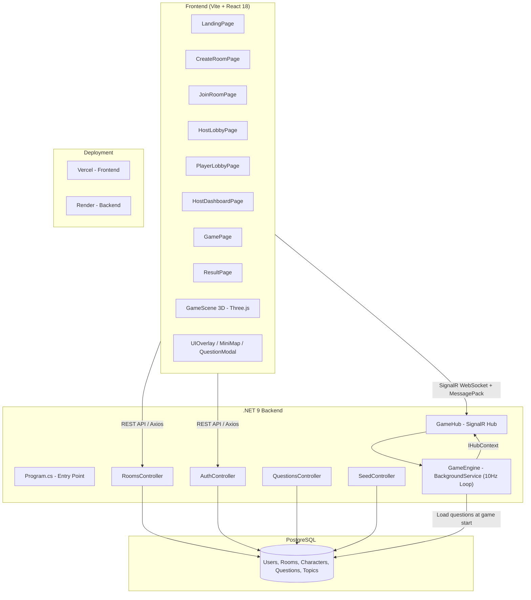
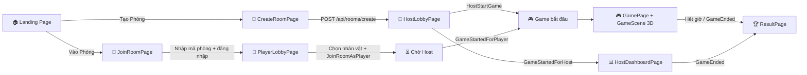
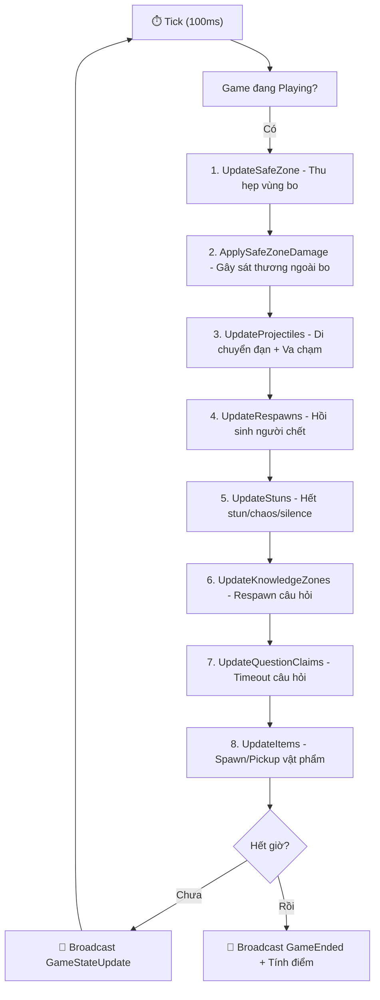
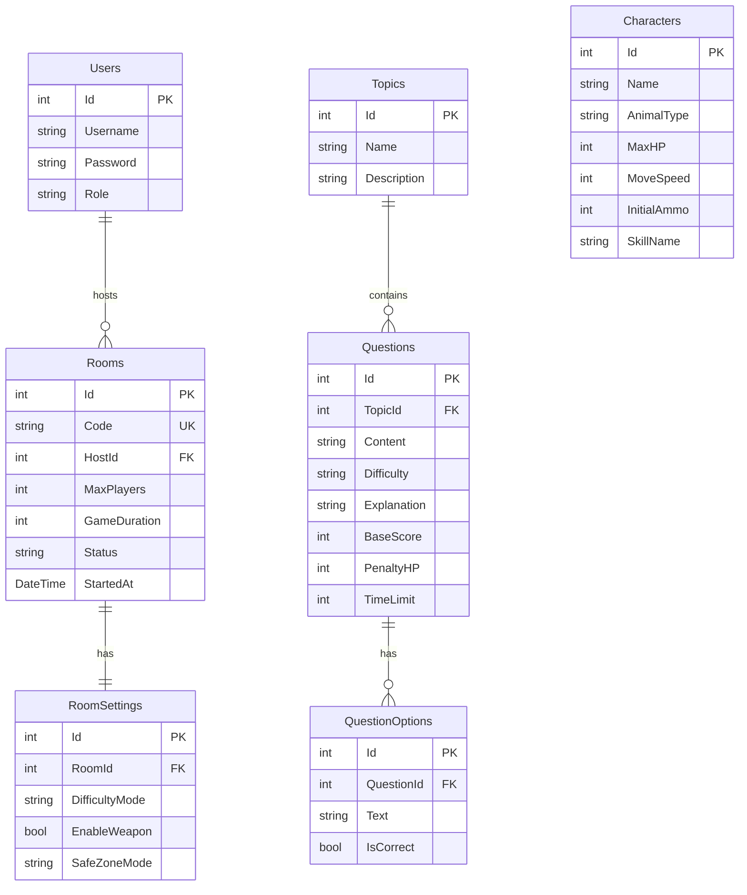

# 🎮 Animal Theory Royale — Mô Tả Hệ Thống Chi Tiết

## 1. Tổng Quan

**Animal Theory Royale** là một game multiplayer real-time kết hợp giữa **Battle Royale 3D** và **Quiz (trả lời câu hỏi lý thuyết)**. Người chơi chọn nhân vật động vật, di chuyển trên bản đồ 3D, trả lời câu hỏi để ghi điểm, bắn nhau, sử dụng kỹ năng, và sống sót trong vùng bo ngày càng thu hẹp.

> [!IMPORTANT]
> **Mục đích giáo dục:** Game được thiết kế cho giảng viên tổ chức thi đấu kiến thức trong lớp học. Host (giảng viên) tạo phòng, sinh viên vào chơi và trả lời câu hỏi môn học.

---

## 2. Kiến Trúc Hệ Thống

| Layer | Tech Stack |
|-------|-----------|
| **Frontend** | React 18, Vite, Three.js (R3F), TailwindCSS, Framer Motion, Zustand |
| **Real-time** | SignalR WebSocket + **MessagePack** (binary protocol) |
| **Backend** | .NET 9, ASP.NET Core, Entity Framework Core |
| **Database** | PostgreSQL (Render managed) |
| **Deploy** | Vercel (Frontend), Render Free Tier (Backend) |

---

## 3. Luồng Người Dùng (User Flow)

### Luồng HOST (Giảng viên):
1. `LandingPage` → Nhấn "Tạo Phòng"
2. `CreateRoomPage` → Nhập tên, chọn thời gian (10/15/20 phút), độ khó → POST `/api/rooms/create`
3. `HostLobbyPage` → Hiển thị mã phòng 5 ký tự, danh sách người chơi real-time, chọn số câu hỏi → Nhấn "Bắt Đầu"
4. `HostDashboardPage` → Bản đồ radar chiến thuật theo dõi toàn bộ người chơi real-time
5. `ResultPage` → Bảng xếp hạng cuối trận

### Luồng PLAYER (Sinh viên):
1. `LandingPage` → Nhấn "Vào Phòng"
2. `JoinRoomPage` → Nhập mã phòng + tên → POST `/api/auth/login`
3. `PlayerLobbyPage` → Chọn 1 trong 4 nhân vật → `JoinRoomAsPlayer` (SignalR)
4. Chờ Host bắt đầu → Nhận event `GameStartedForPlayer`
5. `GamePage` → Chơi game 3D
6. `ResultPage` → Xem kết quả

---

## 4. Hệ Thống Nhân Vật

| ID | Tên | Emoji | HP | Speed | Ammo | Đặc điểm |
|----|-----|-------|-----|-------|------|-----------|
| 1 | Voi | 🐘 | 200 | 20 | 15 | **Tanker** - Máu nhiều, chậm |
| 2 | Thỏ | 🐇 | 80 | 45 | 6 | **Speedster** - Nhanh nhất, máu ít |
| 3 | Cáo | 🦊 | 100 | 35 | 10 | **Strategist** - Cân bằng |
| 4 | Rùa | 🐢 | 150 | 25 | 8 | **Defender** - Phòng thủ cao |

---

## 5. Hệ Thống Kỹ Năng (Skills)

| Kỹ năng | Hub Method | Cooldown | Mô tả |
|---------|-----------|----------|--------|
| **Push** | `UseSkillPush` | 8s | Đẩy lùi đối thủ trong hình nón 60°, bán kính 25 đơn vị, lực đẩy 150 |
| **Double** | `UseSkillDouble` | 15s | Nhân đôi điểm thưởng (hoặc hình phạt!) cho câu hỏi tiếp theo |
| **Chaos** | `UseSkillChaos` | 10s | Đảo ngược điều khiển di chuyển của đối thủ trong 3 giây, bán kính 20 |
| **Silence** | `UseSkillSilence` | 12s | Bắn tia im lặng theo hướng nhìn, khóa kỹ năng đối thủ 4 giây |

---

## 6. GameEngine — Vòng Lặp Server (10 Hz)

[GameEngine.cs](file:///d:/FULearning/SUMMER%202026%20Final/gemaDongVat/AnimalTheoryRoyale/Backend/Services/GameEngine.cs) chạy như `BackgroundService`, tick mỗi **100ms** (10 lần/giây):

### Cơ chế Safe Zone (Bo):

| Phase | Chờ | Bán kính mục tiêu | Sát thương/giây |
|-------|-----|-------------------|-----------------|
| 1 | 90s | 400 | 2 |
| 2 | 75s | 300 | 3 |
| 3 | 60s | 200 | 5 |
| 4 | 45s | 120 | 8 |
| 5 | 30s | 60 | 12 |
| 6 | 20s | 25 | 20 |

---

## 7. Hệ Thống Câu Hỏi (Knowledge Zones)

### Luồng xử lý:

1. **Khi game bắt đầu:** `InitializeKnowledgeZonesFromDB()` load toàn bộ câu hỏi từ PostgreSQL vào RAM (`QuestionPool`)
2. **Trên bản đồ:** Spawn N zone (10/20/50/100 tùy cấu hình), mỗi zone gắn 1 câu hỏi duy nhất
3. **Khi người chơi đến gần zone (≤16 đơn vị):** Frontend gọi `ClaimQuestion`
4. **Server kiểm tra:** Nếu câu này người chơi đã trả lời → tự động gán câu khác chưa trả lời (Anti-Repetition)
5. **Người chơi trả lời:** Frontend gọi `SubmitAnswer` → Server tính điểm
6. **Zone bị tiêu thụ:** Biến mất 25 giây → Respawn với câu hỏi mới + có thể đổi loại

### Loại Zone:

| Loại | Tỷ lệ | Đặc điểm |
|------|--------|----------|
| **Normal** | 65% | Câu hỏi thường |
| **LootBox** 🎁 | 15% | Trả lời đúng → nhận buff (Heal/Speed/Scorex2/Ammo) |
| **Boss** 👹 | 5% | Điểm x5 nhưng khó hơn |
| **Trap** 💀 | 10% | Trả lời sai → Stun 3s + Sát thương x2 |

### Hệ thống Combo:

| Combo | Nhân điểm |
|-------|-----------|
| x1 | 1x |
| x2 | 2x |
| x3+ | 3x |
| x5+ | 4x |

> Trả lời sai → Reset combo về 0, mất 30 điểm + mất HP.

---

## 8. Hệ Thống Vật Phẩm (Items)

Server tự động spawn vật phẩm trong vùng bo (tối đa 15 cùng lúc):

| Loại | Emoji | Hiệu ứng |
|------|-------|----------|
| **HP** | ❤️ | +30 HP |
| **Score** | 💎 | +50 Điểm |
| **Speed** | ⚡ | Tăng tốc 1.5x trong 15 giây |

Bán kính nhặt: 3 đơn vị. Thông báo hiển thị 0.7 giây.

---

## 9. Hệ Thống Chiến Đấu

- **Bắn đạn:** `ShootProjectile` → đạn bay theo hướng camera, tốc độ cố định, tầm bắn giới hạn
- **Sát thương đạn:** Trúng đối thủ (bán kính va chạm 8 đơn vị) → gây damage, +10 điểm cho người bắn
- **Giết đối thủ:** +100 điểm cho người giết, người chết mất 50 điểm
- **Hồi sinh:** Sau 8 giây, hồi sinh tại vị trí random trong bo với 50% HP + 3 giây bất tử
- **Question Shield:** Khi đang trả lời câu hỏi → bất tử (vòng vàng), tối đa 25 giây

---

## 10. SignalR Events Map

### Client → Server (Hub Methods):

| Method | Params | Mô tả |
|--------|--------|--------|
| `JoinRoomAsHost` | roomCode | Host vào phòng |
| `JoinRoomAsPlayer` | roomCode, username, characterId | Player vào phòng |
| `HostStartGame` | roomCode, questionCount | Bắt đầu game |
| `HostEndGame` | roomCode | Kết thúc sớm |
| `PlayerMove` | roomCode, x, y, z, rotationY | Cập nhật vị trí |
| `ShootProjectile` | roomCode, dirX, dirZ | Bắn đạn |
| `UseSkillPush/Double/Chaos/Silence` | roomCode, [dirX, dirZ] | Dùng kỹ năng |
| `ClaimQuestion` | roomCode, zoneId | Nhận câu hỏi |
| `SubmitAnswer` | roomCode, zoneId, optionId | Nộp đáp án |

### Server → Client (Events):

| Event | Data | Tần suất |
|-------|------|----------|
| `LobbyState` | `[{connectionId, username, characterId}]` | Khi có người vào/ra |
| `PlayerJoined` | `{connectionId, username, characterId}` | Khi có người vào |
| `GameStartedForHost` | — | 1 lần |
| `GameStartedForPlayer` | — | 1 lần |
| `GameStateUpdate` | Toàn bộ snapshot (players, projectiles, items, safeZone, knowledgeZones) | **10 lần/giây** |
| `QuestionReceived` | `{zoneId, questionId, content, options, timeLimit}` | Khi claim zone |
| `AnswerResult` | `{correct, message, explanation, scoreGained/hpLost}` | Khi trả lời/nhặt item |
| `SkillUsed` | `{type, by, targets, dirX, dirZ}` | Khi dùng skill |
| `GameEnded` | `[{username, score, finalRank, totalCorrectAnswers, ...}]` | 1 lần khi hết giờ |

---

## 11. REST API Endpoints

| Method | Endpoint | Mô tả |
|--------|----------|--------|
| POST | `/api/auth/login` | Đăng nhập (tạo user nếu chưa có) |
| POST | `/api/rooms/create` | Tạo phòng mới |
| POST | `/api/rooms/{roomCode}/start` | Bắt đầu game (backup) |
| GET | `/api/rooms/characters` | Lấy danh sách 4 nhân vật |
| POST | `/api/questions/seed` | Seed câu hỏi vào DB |
| GET | `/api/questions` | Lấy danh sách câu hỏi |

---

## 12. Database Schema

---

## 13. Frontend Components Map

| Component | File | Chức năng |
|-----------|------|-----------|
| **GameScene** | `game3d/GameScene.jsx` | Vòng lặp render 3D: camera, di chuyển, bắn, skill, nhặt item |
| **PlayerCharacter** | `game3d/PlayerCharacter.jsx` | Render nhân vật 3D (Voi/Thỏ/Cáo/Rùa) + shield/stun/buff effects |
| **MapEnvironment** | `game3d/MapEnvironment.jsx` | Địa hình: đất, cây, đá, tòa nhà, hồ nước |
| **KnowledgeZone** | `game3d/KnowledgeZone.jsx` | Cột sáng câu hỏi trên bản đồ |
| **SafeZone** | `game3d/SafeZone.jsx` | Vòng bo xanh |
| **ItemPickup** | `game3d/ItemPickup.jsx` | Vật phẩm xoay trên bản đồ |
| **UIOverlay** | `components/UIOverlay.jsx` | HUD: HP bar, điểm, ammo, combo, skill buttons, timer |
| **MiniMap** | `components/MiniMap.jsx` | Bản đồ thu nhỏ góc màn hình |
| **QuestionModal** | `components/QuestionModal.jsx` | Modal câu hỏi + đếm ngược + 4 đáp án |
| **HostDashboard** | `components/HostDashboard.jsx` | Radar chiến thuật cho Host |
| **TouchControls** | `components/TouchControls.jsx` | Joystick ảo cho mobile |

---

## 14. Tối Ưu Hiệu Năng Đã Áp Dụng

| Tối ưu | Chi tiết |
|--------|----------|
| **MessagePack Protocol** | Thay JSON bằng binary → giảm ~70% băng thông |
| **Tickrate 10Hz** | Server broadcast 10 lần/giây (thay vì 20) → giảm 50% CPU |
| **In-Memory Question Pool** | Câu hỏi load 1 lần từ DB vào RAM khi game start → 0 DB call trong game |
| **ConcurrentDictionary** | Thread-safe cho tất cả state: Players, Projectiles, Items, Zones |
| **Client-side Interpolation** | Frontend dùng `lerp()` để nội suy vị trí mượt mà giữa các tick |
| **Conditional Rendering** | Mobile: tắt shadow, giảm DPR, đơn giản hóa geometry |

---

## 15. Deployment

| Service | Platform | URL |
|---------|----------|-----|
| Frontend | **Vercel** | Auto-deploy từ `main` branch |
| Backend | **Render** (Free Tier) | 0.1 CPU, 512MB RAM |
| Database | **Render PostgreSQL** | Managed instance |
| Repo | GitHub | `Tcanh12/Battle-of-Knowledge` |

> [!WARNING]
> **Giới hạn Render Free:** Tối ưu cho ~15-20 người/phòng. Trên 30 người có thể gây lag do giới hạn 0.1 CPU.
